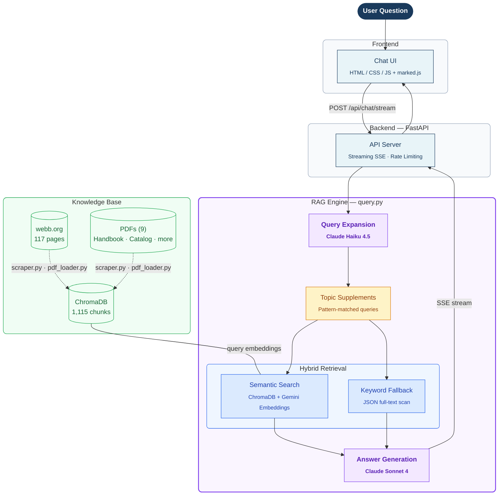
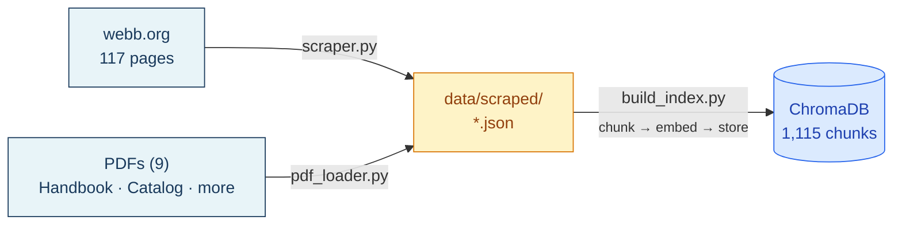

# WebbGPT - AI Assistant for The Webb Schools

A RAG-based AI chatbot that answers questions about The Webb Schools (Claremont, CA), covering admissions, academics, student life, policies, athletics, and more.

Built by the Webb Schools Coding/AI Club.

**Live Demo**: [webb-ai.onrender.com](https://webb-ai.onrender.com) (free tier, first load may take ~30s)

## Architecture



**Tech Stack**:

| Component | Technology |
|-----------|-----------|
| **Embeddings** | Google Gemini `gemini-embedding-001` (768 dims) |
| **Generation** | Claude Sonnet 4 (answers) + Claude Haiku 4.5 (query expansion) |
| **Vector DB** | ChromaDB (local, persistent, 1,115 chunks) |
| **Backend** | Python · FastAPI · Uvicorn |
| **Frontend** | HTML / CSS / JS · marked.js (Markdown) |
| **Hosting** | Render (free tier) |

## Knowledge Base Sources

All data comes from **official Webb Schools sources only**:

| Source | Type | Content | Last Updated |
|--------|------|---------|-------------|
| [webb.org](https://www.webb.org) (117 pages) | Website | Admissions, academics, student life, athletics, alumni, summer programs, curriculum details | 2025-03 |
| Student Handbook 2025-26 | PDF | Policies, discipline, dorm rules, passes, honor code, daily schedule | 2025-26 school year |
| Course Catalog 2026-27 | PDF | Course descriptions, prerequisites, graduation requirements | 2026-27 school year |
| College Guidance Brochure 2025-26 | PDF | Enrollment stats, GPA calculation, college guidance process | 2025-26 school year |
| + 5 more PDFs | PDF | Device guidelines, tech FAQ, AUP, travel dates, etc. | 2025-26 school year |

### Data Pipeline



- **1,115 chunks** in the vector index (117 web pages + 9 PDFs)
- Chunk size: 1,200 chars with 250 overlap, paragraph-aware splitting
- Embedding: Gemini `gemini-embedding-001` (768 dimensions)

## Project Structure

```
webb-ai/
├── api/
│   └── main.py              # FastAPI server (chat API + static files)
├── rag/
│   ├── query.py              # RAG engine (retrieval + generation)
│   └── build_index.py        # Vector index builder
├── ingest/
│   ├── scraper.py            # Webb.org website scraper
│   └── pdf_loader.py         # PDF text extractor
├── frontend/
│   ├── index.html            # Chat UI
│   ├── app.js                # Client-side logic + streaming
│   └── style.css             # Styles (mobile-responsive)
├── data/
│   ├── scraped/              # JSON files (intermediate)
│   └── pdfs/                 # Source PDF files
├── chroma_db/                # Vector database (committed)
├── tests/
│   ├── test_questions.json   # 35 test questions (8 categories)
│   ├── run_tests.py          # Automated test runner
│   └── test_results.md       # Latest test results
├── .env                      # API keys (not committed)
├── .env.example              # Template for .env
├── render.yaml               # Render deployment config
├── requirements.txt          # Python dependencies
└── .python-version           # Python 3.12.7
```

## Setup (Local Development)

### 1. Clone and install

```bash
git clone https://github.com/szkangjian/webb-ai.git
cd webb-ai
pip install -r requirements.txt
```

### 2. Configure API keys

```bash
cp .env.example .env
# Edit .env and add your keys:
# ANTHROPIC_API_KEY=sk-ant-...
# GEMINI_API_KEY=AIza...
```

### 3. Run the server

```bash
cd api
python main.py
# Open http://localhost:8000
```

The vector database (`chroma_db/`) is already committed, so you can start querying immediately without rebuilding the index.

## Maintenance Guide

### Adding New Information Sources

#### Scenario A: Webb.org updated their website

```bash
# 1. Re-scrape the website
python ingest/scraper.py

# 2. Rebuild the vector index (overwrites old index)
python rag/build_index.py

# 3. Test
python tests/run_tests.py

# 4. Commit and deploy
git add chroma_db/ data/scraped/
git commit -m "Update knowledge base from latest webb.org"
git push   # Render auto-deploys
```

#### Scenario B: New PDF document (e.g., updated handbook)

```bash
# 1. Place the PDF in data/pdfs/
cp "New Handbook 2026-27.pdf" data/pdfs/

# 2. Extract text from PDFs
python ingest/pdf_loader.py

# 3. Rebuild the vector index
python rag/build_index.py

# 4. Test and deploy (same as above)
```

#### Scenario C: Adding a completely new source (e.g., a Google Doc, FAQ page)

Create a JSON file in `data/scraped/` with this format:

```json
{
  "url": "source-identifier",
  "title": "Document Title",
  "content": "Full text content here..."
}
```

Then rebuild the index: `python rag/build_index.py`

### Removing Outdated Information

This is the harder problem. Since the vector index is built from all JSON files in `data/scraped/`, you need to:

```bash
# 1. Delete the outdated JSON file
rm data/scraped/pdf_old_handbook_2024.json

# 2. Delete the entire vector database
rm -rf chroma_db/

# 3. Rebuild from scratch (only current files will be indexed)
python rag/build_index.py

# 4. Test to make sure nothing broke
python tests/run_tests.py
```

**Important**: There is no "partial update" — you must rebuild the entire index. This takes about 10 minutes due to Gemini API rate limits (1,115 chunks x embedding calls).

### Annual Maintenance Checklist

Each school year (typically August):

1. **Replace** `data/pdfs/` with the new Student Handbook and Course Catalog
2. **Re-run** `python ingest/pdf_loader.py` to extract text
3. **Re-run** `python ingest/scraper.py` to get latest website content
4. **Delete** old JSON files from `data/scraped/` (e.g., last year's handbook)
5. **Delete** `chroma_db/` and rebuild: `python rag/build_index.py`
6. **Run tests**: `python tests/run_tests.py`
7. **Review** test results in `tests/test_results.md`
8. **Commit and push** to trigger redeployment

### Updating Topic-Specific Search (query.py)

If you notice the chatbot missing information on specific topics, you can improve retrieval by editing `rag/query.py`:

- **`TOPIC_SUPPLEMENTS`**: Maps question patterns to additional search queries
- **`KEYWORD_TRIGGERS`**: Maps question patterns to exact keyword searches in raw text
- These are hardcoded for common topics (passes, discipline, etc.) — add more as needed

## Deployment

### Render (Current)

The project is deployed on [Render](https://render.com) using the free tier.

**Configuration**: see `render.yaml`

**Environment variables** (set in Render dashboard):
- `ANTHROPIC_API_KEY` — Claude API key
- `GEMINI_API_KEY` — Google Gemini API key

**Auto-deploy**: Render watches the `main` branch. Every `git push` triggers a redeploy.

**Free tier limitations**:
- Service sleeps after 15 minutes of inactivity
- Cold start takes ~30-50 seconds
- 512 MB RAM, 750 hours/month

### Deploying Elsewhere

The app is a standard Python FastAPI service. To deploy on any platform:

```bash
# Install dependencies
pip install -r requirements.txt

# Set environment variables
export ANTHROPIC_API_KEY=sk-ant-...
export GEMINI_API_KEY=AIza...

# Start the server
uvicorn api.main:app --host 0.0.0.0 --port 8000
```

Requirements:
- Python 3.12+
- ~512 MB RAM minimum
- The `chroma_db/` directory must be present (committed in repo)
- The `data/scraped/` directory must be present (for keyword fallback)

## Testing

```bash
# Run the full test suite (35 questions, takes ~10 minutes)
python tests/run_tests.py

# Results saved to:
# - tests/test_results.json (raw data)
# - tests/test_results.md (formatted report)
```

**Latest results**: 93.7% average coverage across 35 questions in 8 categories.

## Cost Estimate

| Component | Cost | Notes |
|-----------|------|-------|
| Claude Sonnet (answers) | ~$0.004/query | ~20 chunks context + response |
| Claude Haiku (query expansion) | ~$0.0003/query | Short prompt |
| Gemini Embeddings | ~$0.0001/query | 12 queries x 768 dims |
| Render hosting | Free | Free tier, paid starts at $7/mo |
| **Total per query** | **~$0.005** | **~$5 per 1000 questions** |

## Documentation

| Document | Description |
|----------|-------------|
| [Knowledge Base Guide](docs/knowledge-base-guide.md) | How data is acquired, processed, and maintained |
| [Product Roadmap](docs/roadmap.md) | Feature priorities and development phases |

## License

This project is for educational use by The Webb Schools community.

## Credits

Built by the Webb Schools Coding/AI Club with assistance from Claude (Anthropic).
