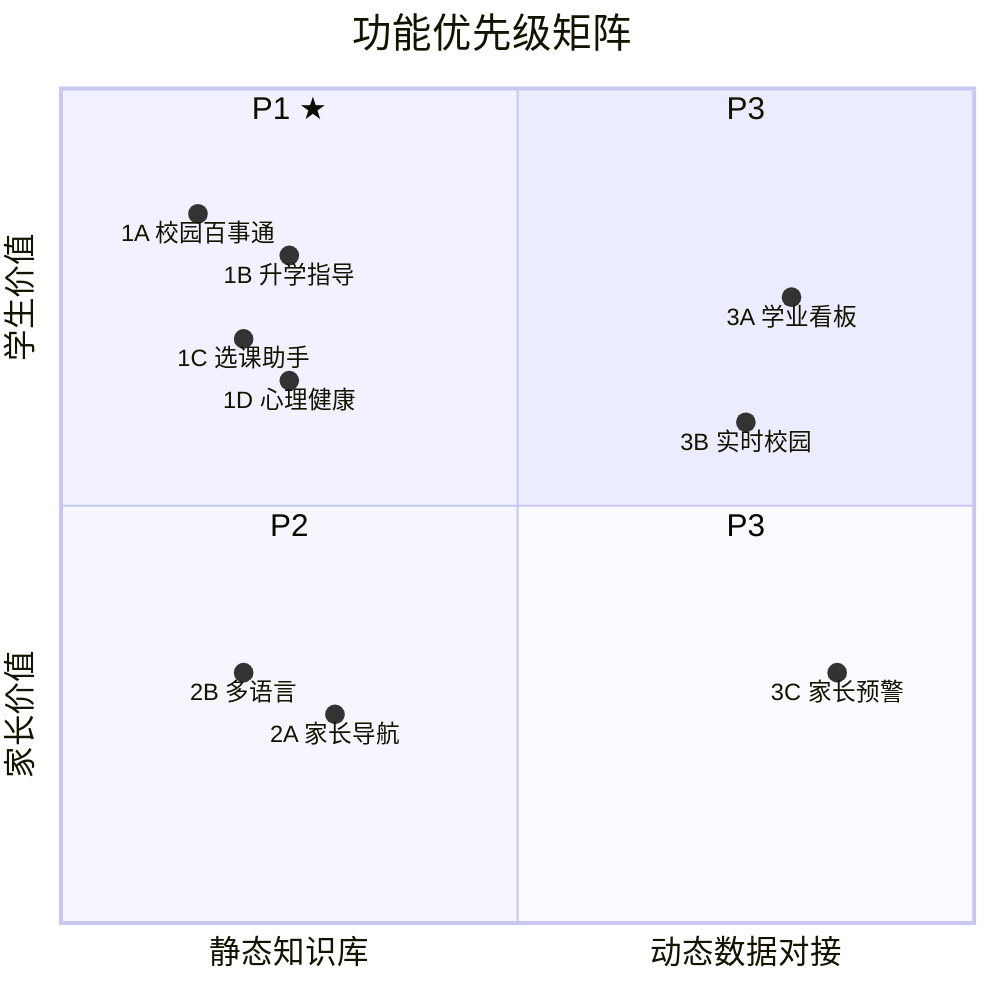
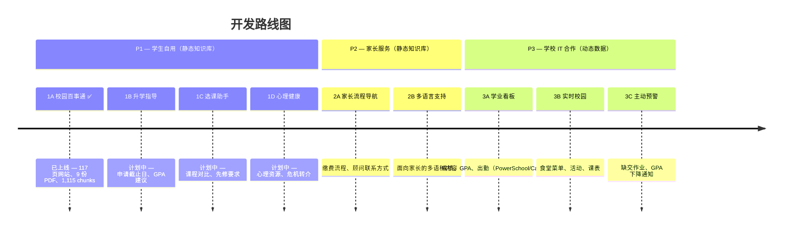

# WebbGPT 产品路线图

> 学生自建 RAG AI 校园助手的功能优先级规划。

---

## 优先级逻辑

传统产品优先级（"先做给决策者看"、"快速交付 demo 做商业验证"）在这里不适用。这是一个由兴趣和实际使用驱动的学生项目。

**核心框架：学生动力 × 技术可行性**

---

## P1：学生自己最想用 + 技术门槛低

全部基于静态知识库，不需要对接任何系统，学生可以端到端自主完成。

### 1A. 校园百事通 ✅ 已上线

**状态：已上线**（[webb-ai.onrender.com](https://webb-ai.onrender.com)）

覆盖类别：

| 类别 | 举例 | 数据源 |
|------|------|--------|
| 课程与学分 | 课程介绍、先修要求、毕业要求 | 课程目录、课程详情页 |
| 寄宿生活 | 宿舍政策、换房、宿舍设施 | 学生手册 |
| 请假与外出 | Overnight Pass、Weekend Leave、外出流程 | 学生手册 |
| 交通出行 | 开车政策、接送、机场交通 | 学生手册 |
| 校园设施 | 图书馆、健身房、各楼位置、开放时间 | webb.org |
| 社团与课外活动 | 社团列表、加入方式、活动安排 | webb.org |
| 体育运动 | 校队信息、赛程、选拔、夏季训练 | webb.org（33 个运动队页面） |
| 暑期项目 | 项目类型、日期、报名 | webb.org |
| 纪律与行为规范 | Honor Code、处分政策、着装要求 | 学生手册 |
| 技术与设备 | WiFi、设备要求、AUP、技术支持 | AUP、设备指南、技术 FAQ |
| 日程与校历 | 作息时间、假期、搬入/搬出日期 | 旅行日期 PDF、webb.org |
| 联系方式与通讯录 | 教师邮箱、部门电话、Advisor | webb.org、升学指导手册 |
| 招生与入学 | 申请流程、校园参观、国际生 | webb.org |
| 校园安全 | 紧急联络、安全流程 | 学生手册 |

已完成：
- RAG 完整流程：抓取 → 分块 → 嵌入 → 检索 → 生成
- webb.org 117 个页面 + 9 份 PDF → ChromaDB 1,115 个 chunks（768 维 Gemini 嵌入）
- 全语种支持（任何语言输入，任何语言输出；跨语言检索）
- 流式响应 + 来源引用标注
- 移动端适配 UI + 网站图标
- 部署于 Render（免费层，main 分支自动部署）

已知待改进项：
- 回答中的元引用语言（"根据文件显示…"）— 等待学校反馈
- LLM 测试评判器误报率较高 — 需要改进

### 1B. 升学指导与申请支持

| 类别 | 举例 | 数据源 |
|------|------|--------|
| 升学指导 | 申请时间线、推荐信、文书建议 | 升学指导手册（已导入） |
| 申请截止日期 | UC/Common App/CSU 截止日、所需材料 | 待补：截止日期参考文档 |
| 大学匹配 | 基于 GPA 的大学建议、历年录取记录 | 待补：webb.org/acceptances、Naviance/Scoir |
| 成绩单与考试 | 成绩单申请、标化考试信息 | 待补：升学指导老师材料 |
| 助学金（大学） | FAFSA、CSS Profile、奖学金截止日期 | 待补：助学金参考文档 |
| a-g 要求 | UC 录取资格、逐科要求 | 课程目录（已导入） |

### 1C. 选课助手

| 类别 | 举例 | 数据源 |
|------|------|--------|
| 课程对比 | AP 与 Honors 区别、课业量预期 | 课程目录（已导入）、课程详情页（已导入） |
| 选课/转课流程 | 如何换课/退课、加退选截止日 | 待补：选课流程文档 |
| 先修要求 | 高阶课程的前置课程要求 | 课程目录（已导入） |
| GPA 计算 | 加权与非加权、AP/Honors 加分 | 升学指导手册（已导入） |
| 学术支持 | 辅导资源、学习中心、Office Hours | 待补：学术支持信息 |

### 1D. 心理健康与身心支持

| 类别 | 举例 | 数据源 |
|------|------|--------|
| 咨询服务 | 学校心理咨询师、保密性、如何预约 | 学生手册（已导入）、webb.org |
| 危机资源 | 热线号码、紧急转介流程 | 待补：危机资源清单 |
| 同伴支持 | 同伴辅导项目、支持小组 | 待补：学生生活材料 |
| 健康服务 | 校医、就医政策、用药规定 | 学生手册（已导入） |

---

## P2：家长服务 + 技术门槛低

技术上同样基于静态知识库。扩展 P1 内容，补充家长视角。

### 2A. 家长流程导航

| 类别 | 举例 | 数据源 |
|------|------|--------|
| 学费与缴费 | 缴费日期、支付方式、分期计划 | 待补：缴费/学费文档 |
| 助学金（学校） | 申请截止日、所需材料、续签 | webb.org（已抓取） |
| 家校沟通 | 家长会、成绩通报、紧急联络 | 待补：家长手册 |
| 学术支持 | 辅导资源、Advisor 联系方式、干预流程 | 待补：家长迎新材料 |
| 访客政策 | 周末探访、签到流程、校园出入 | 学生手册（已导入） |

### 2B. 多语言家长支持

| 类别 | 举例 | 数据源 |
|------|------|--------|
| 多语言问答 | 任何语言提问（已支持） | 所有现有数据源 |
| 家长语言测试 | 验证中文、韩语、西班牙语的覆盖度 | 测试 + 提示词调优 |
| 翻译版 FAQ | 常见家长问题的多语种预测试 | 待补：整理 FAQ 内容 |

---

## P3：最有价值，但需要学校 IT 介入

学生自己无法完成。需要学校 IT 部门授权 API 访问，且须符合 FERPA 合规要求。

### 3A. 个人学业看板

| 类别 | 举例 | 技术要求 |
|------|------|----------|
| 成绩与分数 | 考试成绩、作业分数、季度成绩 | PowerSchool / Canvas API |
| GPA 追踪 | 当前 GPA、GPA 趋势、年级排名 | PowerSchool API |
| 出勤记录 | 缺勤记录、迟到次数 | PowerSchool API |
| 缺交作业 | 逾期作业、即将到期的作业 | Canvas API |
| **身份认证** | 学生身份验证 | SSO 集成 |

### 3B. 实时校园信息

| 类别 | 举例 | 技术要求 |
|------|------|----------|
| 餐饮 | 今日菜单、过敏原信息、用餐时间 | 食堂菜单数据接口 |
| 活动与事件 | 周末活动、集会、特殊日程 | 日历 API |
| 体育赛程 | 比赛时间、训练安排、校车出发时间 | 体育日历 API |
| 个人课表 | 下节课、教室位置、任课教师 | PowerSchool API |

### 3C. 家长主动预警

| 类别 | 举例 | 技术要求 |
|------|------|----------|
| 学业预警 | 缺交作业、GPA 低于阈值 | PowerSchool/Canvas API + 推送系统 |
| 财务提醒 | 学费到期日、付款确认 | 缴费系统集成 |
| 出勤预警 | 无故缺勤、迟到规律 | PowerSchool API + 推送系统 |
| **配置** | 通知偏好、订阅/退订、阈值设置 | 家长门户 + 通知服务 |

**推进时机**：当 P1、P2 上线并稳定运行，学校看到效果后，IT 部门才有动力开放接口。

---

## 不变的边界

不管顺序怎么调，有一条线始终成立：

| 范围 | 决定权 |
|------|--------|
| 静态知识库（公开信息） | 学生自主决定 |
| 学生个人数据（成绩、出勤） | 必须有学校正式授权 |

这不是预算问题，是 **FERPA 合规问题**——读取学生的成绩和出勤记录，即使是好意，没有学校授权也是违法的。这条线不能因为"学生自己做的"就绕过去。

---

## 建议起点

不需要从战略层面规定从哪里开始，问俱乐部成员：

> "你们在学校里，最想让 AI 帮你解决哪一件事？"

答案大概率会落在：大学申请信息、社团查询、或者"我想知道某个课的 GPA 怎么算"这类具体问题上。从那里出发，反而比从外部定义的"最高优先级"更容易做出真正好用的东西。
