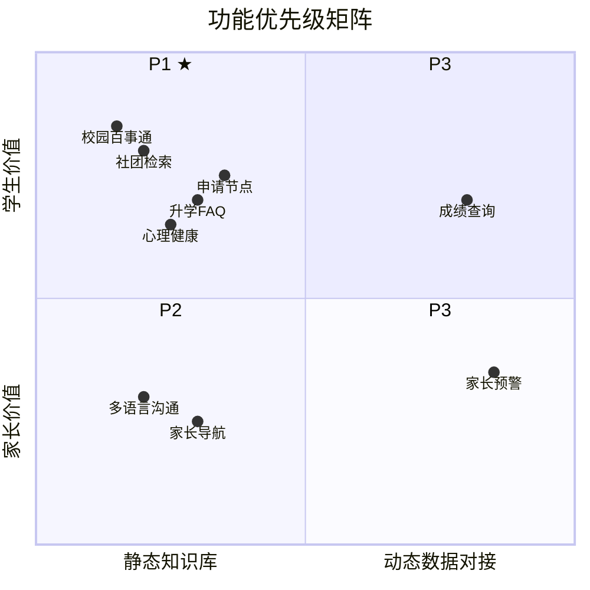
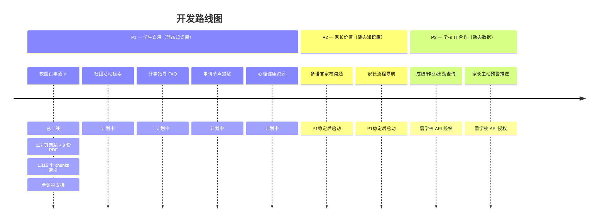

# WebbGPT 产品路线图

> 学生自建 RAG AI 校园助手的功能优先级规划。

---

## 优先级逻辑

传统产品优先级（"先做给决策者看"、"快速交付 demo 做商业验证"）在这里不适用。这是一个由兴趣和实际使用驱动的学生项目。

**核心框架：学生动力 × 技术可行性**

---

## P1：学生自己最想用 + 技术门槛低

全部基于静态知识库，不需要对接任何系统，学生可以端到端自主完成。

| 功能 | 为什么学生有动力 | 难度 |
|------|----------------|------|
| 校园百事通（作息、设施、流程） | 每天都会遇到，自己也烦 | 低 |
| 社团和课外活动检索 | 高中生非常在意课外活动，信息太散 | 低 |
| Counselor 常见问题（a-g、成绩单、FAFSA） | 11/12 年级学生的切身需求 | 中 |
| 大学申请节点提醒 | 亲身焦虑，做完自己先用 | 中 |
| 心理健康资源引导 | 同龄人更愿意接受，他们懂这个障碍 | 中 |

### 当前进展：校园百事通

**状态：已上线**（[webb-ai.onrender.com](https://webb-ai.onrender.com)）

已完成：
- RAG 完整流程：抓取 → 分块 → 嵌入 → 检索 → 生成
- 抓取 webb.org 117 个页面（69 静态页 + 33 运动队页 + 9 其他页面 + 6 个课程详情页通过 Playwright）
- 导入 9 份 PDF 文档（学生手册、课程目录、大学升学指导手册、AUP、设备指南、技术 FAQ、旅行日期等）
- ChromaDB 向量索引 1,115 个 chunks（768 维 Gemini 嵌入）
- 全语种支持（用户可用任何语言提问，跨语言检索英文源文档）
- 流式响应 + 来源引用标注
- 移动端适配 UI + 网站图标
- 部署于 Render（免费层，main 分支自动部署）

已知待改进项：
- 回答中的元引用语言（"根据文件显示…"）— 等待学校反馈
- LLM 测试评判器误报率较高 — 需要改进
- README 中的数据量数字需要更新

---

## P2：对家长有价值 + 技术门槛低

技术上同样基于静态知识库。学生主观动力弱一些，但有家庭语言需求的同学会主动推动。

| 功能 | 说明 | 难度 |
|------|------|------|
| 多语言家校沟通 | 很多家庭有这个需求，是双语支持的自然延伸 | 低 |
| 家长流程导航 | 间接减少家长问学生"这个怎么办" | 中 |

在P1功能跑通后自然延伸。

---

## P3：最有价值，但需要学校 IT 介入

学生自己无法完成。需要学校 IT 部门授权 API 访问。

| 功能 | 卡点 | 难度 |
|------|------|------|
| 成绩 / 作业 / 出勤整合查询 | 需要 PowerSchool / Canvas API 授权，学校 IT 介入 | 高 |
| 家长主动预警推送 | 同上，加上推送系统 | 高 |

**推进时机**：当前两批功能上线并稳定运行，学校看到效果后，IT 部门才有动力开放接口。

---

## 不变的边界

不管顺序怎么调，有一条线始终成立：

| 范围 | 决定权 |
|------|--------|
| 静态知识库（公开信息） | 学生自主决定 |
| 学生个人数据（成绩、出勤） | 必须有学校正式授权 |

这不是预算问题，是 **FERPA 合规问题**——读取学生的成绩和出勤记录，即使是好意，没有学校授权也是违法的。这条线不能因为"学生自己做的"就绕过去。

---

## 建议起点

不需要从战略层面规定从哪里开始，问俱乐部成员：

> "你们在学校里，最想让 AI 帮你解决哪一件事？"

答案大概率会落在：大学申请信息、社团查询、或者"我想知道某个课的 GPA 怎么算"这类具体问题上。从那里出发，反而比从外部定义的"最高优先级"更容易做出真正好用的东西。
