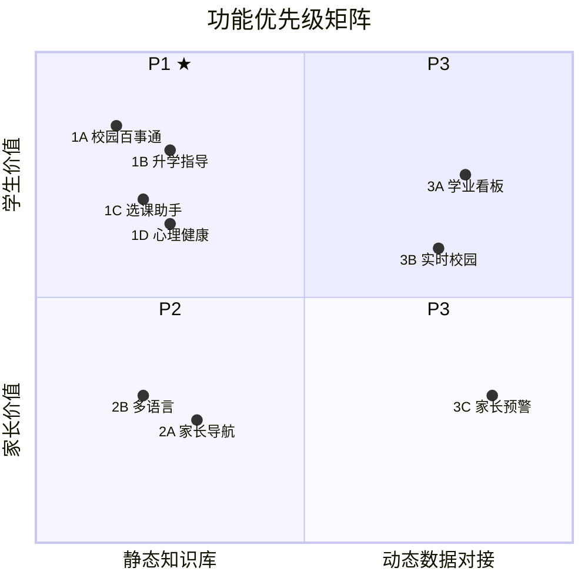
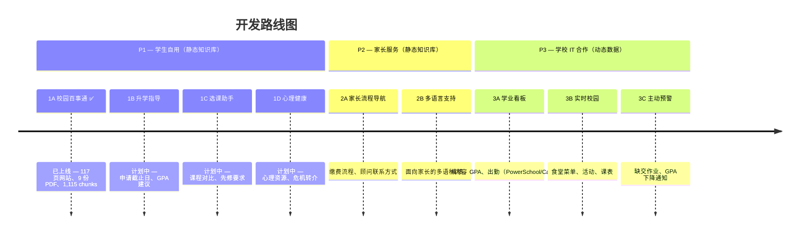

# WebbGPT 产品路线图

> 学生自建 RAG AI 校园助手的功能优先级规划。

---

## 优先级逻辑

传统产品优先级（"先做给决策者看"、"快速交付 demo 做商业验证"）在这里不适用。这是一个由兴趣和实际使用驱动的学生项目。

**核心框架：学生动力 × 技术可行性**

---

## P1：学生自己最想用 + 技术门槛低

全部基于静态知识库，不需要对接任何系统，学生可以端到端自主完成。

### 1A. 校园百事通 ✅ 已上线

**状态：已上线**（[webb-ai.onrender.com](https://webb-ai.onrender.com)）

典型问题：
- "我想加入辩论社，怎么报名？"
- "AP Bio 和 Honors Bio 有什么区别？"
- "我室友打呼噜我睡不着，能换宿舍吗？"
- "春假什么时候？什么时候搬回来？"
- "家长周末可以来学校看我吗？访客政策是什么？"
- "GPA 怎么算？加权还是不加权？"

已完成：
- RAG 完整流程：抓取 → 分块 → 嵌入 → 检索 → 生成
- 抓取 webb.org 117 个页面（69 静态页 + 33 运动队页 + 9 其他页面 + 6 个课程详情页通过 Playwright）
- 导入 9 份 PDF 文档（学生手册、课程目录、大学升学指导手册、AUP、设备指南、技术 FAQ、旅行日期等）
- ChromaDB 向量索引 1,115 个 chunks（768 维 Gemini 嵌入）
- 全语种支持（用户可用任何语言提问，跨语言检索英文源文档）
- 流式响应 + 来源引用标注
- 移动端适配 UI + 网站图标
- 部署于 Render（免费层，main 分支自动部署）

已知待改进项：
- 回答中的元引用语言（"根据文件显示…"）— 等待学校反馈
- LLM 测试评判器误报率较高 — 需要改进

### 1B. 升学指导与申请支持

典型问题：
- "UC 申请截止日期是什么时候？我需要准备什么？"
- "我 GPA 3.6，可以考虑哪些大学？"
- "FAFSA 截止日期是什么时候？需要哪些材料？"
- "怎么申请成绩单？"
- "a-g 要求是什么？"

所需数据源：
- 大学升学指导手册（已导入）
- Common App / UC / CSU 截止日期信息
- Webb 历年大学录取记录（webb.org/acceptances）
- Naviance 或 Scoir 数据（如学校愿意分享）

### 1C. 选课助手

典型问题：
- "AP Bio 和 Honors Bio 有什么不同？"
- "我想转 AP 课程，流程是什么？"
- "AP Chemistry 的先修要求是什么？"
- "哪些选修课算毕业学分？"

所需数据源：
- 课程目录（已导入）
- 课程详情页（已通过 Playwright 抓取）
- 补充选课流程说明（来自升学指导老师的材料）

### 1D. 心理健康与身心资源

典型问题：
- "最近压力很大，学校有人可以聊聊吗？"
- "学校有心理咨询师吗？可以保密吗？"
- "Webb 提供哪些心理健康资源？"
- "我朋友好像很沮丧，我该怎么办？"

所需数据源：
- 学生手册中的身心健康章节（已导入）
- 学校心理咨询服务信息（来自 webb.org）
- 危机热线号码和转介流程

---

## P2：家长服务 + 技术门槛低

技术上同样基于静态知识库。学生主观动力弱一些，但有家庭需求的同学会主动推动。

### 2A. 家长流程导航

典型问题：
- "学费什么时候交？怎么交？"
- "怎么联系孩子的 advisor？"
- "financial aid 申请截止了吗？需要什么材料？"
- "孩子成绩下滑了，学校有辅导资源吗？"
- "周末想去看孩子，访客政策是什么？"
- "孩子想转 AP 课程，流程是什么？"

所需数据源：
- 招生和助学金页面（已抓取）
- 缴费流程文档
- 家长手册或迎新材料（如果有）

### 2B. 多语言家长支持

典型问题：
- "我英语不好，能用中文问吗？"
- "학비 납부 기한이 언제예요?"（学费什么时候交？— 韩语）
- "¿Cuál es la política de visitas?"（访客政策是什么？— 西班牙语）

实现方式：
- 全语种支持在 P1 已实现（任何语言输入，任何语言输出）
- 重点是覆盖家长关心的内容，并针对常见家长语言（中文、韩语、西班牙语）做测试
- 可能需要翻译版 FAQ 或面向家长的提示词调优

---

## P3：最有价值，但需要学校 IT 介入

学生自己无法完成。需要学校 IT 部门授权 API 访问。

### 3A. 个人学业看板

典型问题：
- "我上次数学考了多少分？"
- "我现在 GPA 多少？"
- "我有没有缺交的作业？"
- "这学期我的出勤记录怎么样？"

技术要求：
- PowerSchool / Canvas API 授权（需学校 IT）
- 学生身份认证（SSO 集成）
- 符合 FERPA 的数据处理

### 3B. 实时校园信息

典型问题：
- "今天食堂吃什么？"
- "这周末有什么活动？"
- "我下节课在哪个教室？"

技术要求：
- 食堂菜单数据接口
- 日历 API 集成（校园活动、体育赛程）
- 学生课表数据（PowerSchool）

### 3C. 家长主动预警

典型场景：
- "您的孩子在 AP History 有 2 项作业未交"
- "提醒：学费将在 5 天内到期"
- "您的孩子本季度 GPA 低于 3.0"

技术要求：
- 3A 的全部要求，加上推送通知系统
- 家长通知偏好设置和订阅机制
- 预警阈值配置

**推进时机**：当 P1、P2 上线并稳定运行，学校看到效果后，IT 部门才有动力开放接口。

---

## 不变的边界

不管顺序怎么调，有一条线始终成立：

| 范围 | 决定权 |
|------|--------|
| 静态知识库（公开信息） | 学生自主决定 |
| 学生个人数据（成绩、出勤） | 必须有学校正式授权 |

这不是预算问题，是 **FERPA 合规问题**——读取学生的成绩和出勤记录，即使是好意，没有学校授权也是违法的。这条线不能因为"学生自己做的"就绕过去。

---

## 建议起点

不需要从战略层面规定从哪里开始，问俱乐部成员：

> "你们在学校里，最想让 AI 帮你解决哪一件事？"

答案大概率会落在：大学申请信息、社团查询、或者"我想知道某个课的 GPA 怎么算"这类具体问题上。从那里出发，反而比从外部定义的"最高优先级"更容易做出真正好用的东西。
