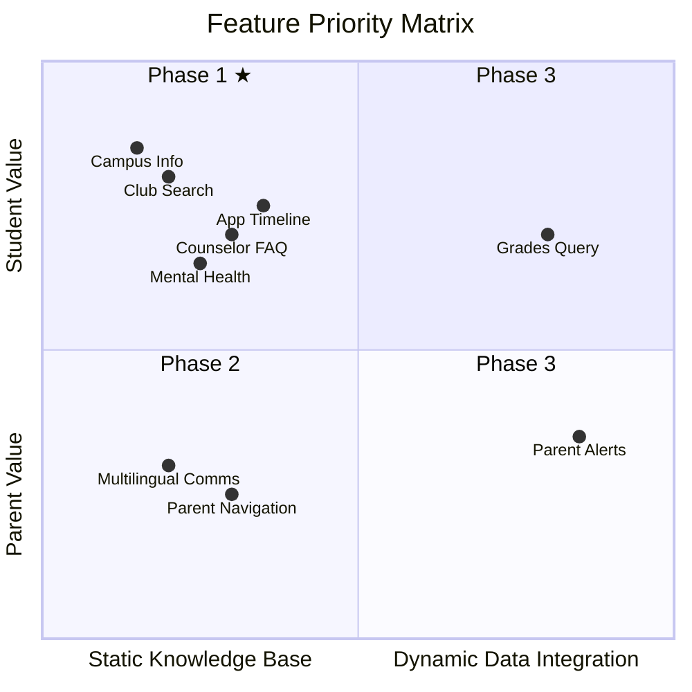
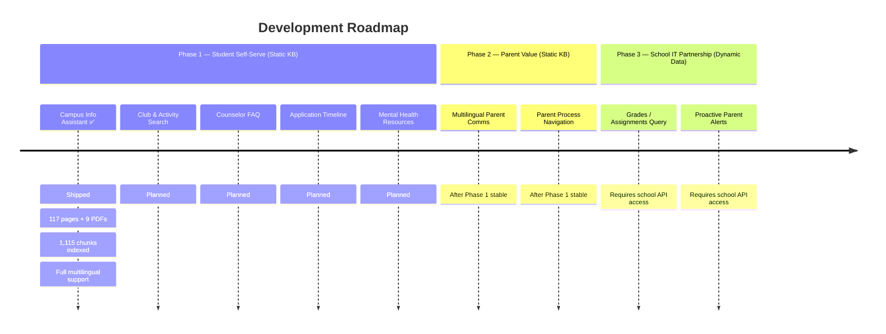

# WebbGPT Product Roadmap

> Feature priorities for a student-built RAG AI campus assistant.

---

## Prioritization Logic

Traditional product prioritization (e.g., "build for decision-makers first" or "ship a demo for business validation") does not apply here. This is a student project driven by interest and real usage.

**Core framework: Student Motivation x Technical Feasibility**

---

## Phase 1: Students Want It Most + Low Technical Barrier

All based on static knowledge base. Students can build end-to-end without external dependencies.

| Feature | Why Students Care | Difficulty |
|---------|------------------|------------|
| Campus Info Assistant | Daily questions about schedules, facilities, processes | Low |
| Club & Extracurricular Search | High school students care deeply about activities; info is scattered | Low |
| Counselor FAQ (a-g, transcripts, FAFSA) | 11th/12th graders' real needs | Medium |
| College Application Timeline Reminders | Personal anxiety; build it, use it first | Medium |
| Mental Health Resource Navigation | Peers are more approachable; they understand the barriers | Medium |

### Current Progress: Campus Info Assistant

**Status: Shipped** (live at [webb-ai.onrender.com](https://webb-ai.onrender.com))

What's been built:
- RAG pipeline: scrape -> chunk -> embed -> retrieve -> generate
- 117 pages scraped from webb.org (69 static + 33 athletics + 9 other + 6 curriculum-detail via Playwright)
- 9 PDF documents ingested (Student Handbook, Course Catalog, College Guidance Brochure, AUP, Device Guidelines, Tech FAQ, Travel Dates, and more)
- 1,115 chunks in ChromaDB vector index (768-dim Gemini embeddings)
- Full multilingual support (users can ask in any language; cross-language retrieval from English source documents)
- Streaming responses with source citations
- Mobile-responsive UI with favicon
- Deployed on Render (free tier, auto-deploy from main branch)

Known improvements pending:
- Meta-reference language in responses ("Based on the documents...") — awaiting school feedback
- LLM-based test judge has high false-positive rate — needs improvement
- README numbers are outdated (will be updated alongside this roadmap)

---

## Phase 2: Parent Value + Low Technical Barrier

Same static knowledge base technology. Students have less personal motivation but may be driven by family needs.

| Feature | Notes | Difficulty |
|---------|-------|------------|
| Multilingual Parent Communication | Many families have this need; natural extension of bilingual support | Low |
| Parent Process Navigation | Reduces "how do I do this?" questions from parents to students | Medium |

Natural extension after Phase 1 is running smoothly. Students with multilingual families may champion this.

---

## Phase 3: Highest Value, Requires School IT Partnership

Cannot be built by students alone. Requires school IT to authorize API access.

| Feature | Blocker | Difficulty |
|---------|---------|------------|
| Grades / Assignments / Attendance Query | PowerSchool / Canvas API authorization from school IT | High |
| Proactive Parent Alerts | Same as above, plus push notification system | High |

**When to pursue**: After Phases 1-2 demonstrate value and the school sees the results, IT will have motivation to open APIs.

---

## Immutable Boundary

Regardless of priority order, one rule always holds:

| Scope | Decision Authority |
|-------|-------------------|
| Static knowledge base (public info) | Students decide autonomously |
| Student personal data (grades, attendance) | Requires formal school authorization |

This is not a budget issue — it's a **FERPA compliance** issue. Reading student grades and attendance records without school authorization is illegal, even with good intentions. Students cannot bypass this just because they built the system.

---

## Recommended Starting Point

Instead of top-down priority assignment, ask club members:

> "What's the one thing you most want AI to help with at school?"

The answer will likely be: college application info, club search, or "how is GPA calculated?" — and that organic starting point will produce something genuinely useful.
