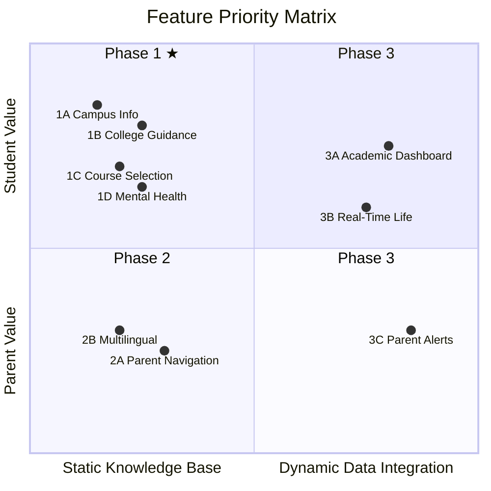
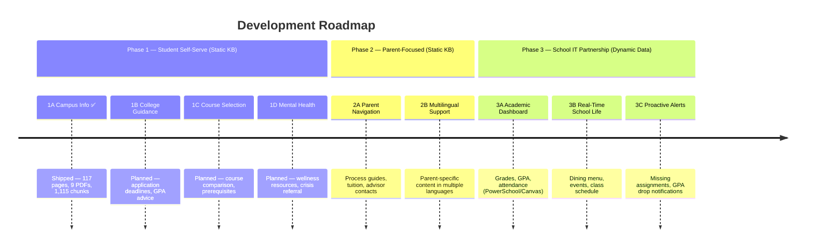

# WebbGPT Product Roadmap

> Feature priorities for a student-built RAG AI campus assistant.

---

## Prioritization Logic

Traditional product prioritization (e.g., "build for decision-makers first" or "ship a demo for business validation") does not apply here. This is a student project driven by interest and real usage.

**Core framework: Student Motivation x Technical Feasibility**

---

## Phase 1: Students Want It Most + Low Technical Barrier

All based on static knowledge base. Students can build end-to-end without external dependencies.

### 1A. Campus Info Assistant ✅ Shipped

**Status: Live** at [webb-ai.onrender.com](https://webb-ai.onrender.com)

Typical questions it can answer:
- "I want to join the debate club — how do I sign up?"
- "What's the difference between AP Bio and Honors Bio?"
- "My roommate snores and I can't sleep — can I switch dorms?"
- "When is spring break? When do we move back in?"
- "What's the visitor policy for parents on weekends?"
- "How is GPA calculated? Weighted or unweighted?"

What's been built:
- RAG pipeline: scrape → chunk → embed → retrieve → generate
- 117 pages scraped from webb.org (69 static + 33 athletics + 9 other + 6 curriculum-detail via Playwright)
- 9 PDF documents ingested (Student Handbook, Course Catalog, College Guidance Brochure, AUP, Device Guidelines, Tech FAQ, Travel Dates, and more)
- 1,115 chunks in ChromaDB vector index (768-dim Gemini embeddings)
- Full multilingual support (users can ask in any language; cross-language retrieval from English source documents)
- Streaming responses with source citations
- Mobile-responsive UI with favicon
- Deployed on Render (free tier, auto-deploy from main branch)

Known improvements pending:
- Meta-reference language in responses ("Based on the documents...") — awaiting school feedback
- LLM-based test judge has high false-positive rate — needs improvement

### 1B. College Guidance & Application Support

Typical questions to support:
- "When is the UC application deadline? What do I need to prepare?"
- "I have a 3.6 GPA — what colleges should I consider?"
- "What's the FAFSA deadline? What documents do I need?"
- "How do I request a transcript?"
- "What are the a-g requirements?"

Data sources needed:
- College Guidance Brochure (already ingested)
- Common App / UC / CSU deadline information
- Webb's college acceptances history (webb.org/acceptances)
- Naviance or Scoir data (if school shares)

### 1C. Course Selection Helper

Typical questions to support:
- "AP Bio vs Honors Bio — what's the difference?"
- "I want to switch to an AP course — what's the process?"
- "What are the prerequisites for AP Chemistry?"
- "Which electives count toward graduation requirements?"

Data sources needed:
- Course Catalog (already ingested)
- Curriculum detail pages (already scraped via Playwright)
- Add course selection process info from counselor materials

### 1D. Mental Health & Wellness Resources

Typical questions to support:
- "I'm feeling really stressed lately — who can I talk to at school?"
- "Is there a school counselor I can see confidentially?"
- "What mental health resources does Webb offer?"
- "My friend seems depressed — what should I do?"

Data sources needed:
- Student Handbook wellness section (already ingested)
- School counseling services info from webb.org
- Crisis hotline numbers and referral procedures

---

## Phase 2: Parent-Focused Features + Low Technical Barrier

Same static knowledge base technology. Students have less personal motivation but may be driven by family needs.

### 2A. Parent Process Navigation

Typical questions to support:
- "When is tuition due? How do I pay?"
- "How do I contact my child's advisor?"
- "What's the financial aid application deadline? What materials do I need?"
- "My child's grades are slipping — what tutoring resources does the school offer?"
- "What's the visitor policy? Can I visit on weekends?"
- "My child wants to transfer to an AP course — what's the process?"

Data sources needed:
- Admissions and financial aid pages (already scraped)
- Tuition and payment process documentation
- Parent handbook or orientation materials (if available)

### 2B. Multilingual Parent Communication

Typical questions to support:
- "我英语不好，能用中文问吗？"（Can I ask in Chinese?）
- "학비 납부 기한이 언제예요?"（When is tuition due? — Korean）
- "¿Cuál es la política de visitas?"（What's the visitor policy? — Spanish）

Implementation:
- Full multilingual support already works in P1 (any language in, any language out)
- Focus here is on parent-specific content coverage and testing with common parent languages (Chinese, Korean, Spanish)
- May need translated FAQ or parent-oriented prompt tuning

---

## Phase 3: Highest Value, Requires School IT Partnership

Cannot be built by students alone. Requires school IT to authorize API access.

### 3A. Personal Academic Dashboard

Typical questions to support:
- "What did I get on my last math test?"
- "What's my current GPA?"
- "Do I have any missing assignments?"
- "What's my attendance record this semester?"

Requirements:
- PowerSchool / Canvas API authorization from school IT
- Student authentication (SSO integration)
- FERPA-compliant data handling

### 3B. Real-Time School Life

Typical questions to support:
- "What's for lunch today?"
- "What events are happening this weekend?"
- "What's my next class and where is it?"

Requirements:
- Dining menu data feed
- Calendar API integration (school events, sports schedules)
- Student schedule data (PowerSchool)

### 3C. Proactive Alerts for Parents

Typical scenarios:
- "Your child has 2 missing assignments in AP History"
- "Reminder: tuition payment due in 5 days"
- "Your child's GPA dropped below 3.0 this quarter"

Requirements:
- All of 3A's requirements, plus push notification system
- Parent notification preferences and opt-in
- Alert threshold configuration

**When to pursue**: After Phases 1-2 demonstrate value and the school sees the results, IT will have motivation to open APIs.

---

## Immutable Boundary

Regardless of priority order, one rule always holds:

| Scope | Decision Authority |
|-------|-------------------|
| Static knowledge base (public info) | Students decide autonomously |
| Student personal data (grades, attendance) | Requires formal school authorization |

This is not a budget issue — it's a **FERPA compliance** issue. Reading student grades and attendance records without school authorization is illegal, even with good intentions. Students cannot bypass this just because they built the system.

---

## Recommended Starting Point

Instead of top-down priority assignment, ask club members:

> "What's the one thing you most want AI to help with at school?"

The answer will likely be: college application info, club search, or "how is GPA calculated?" — and that organic starting point will produce something genuinely useful.
