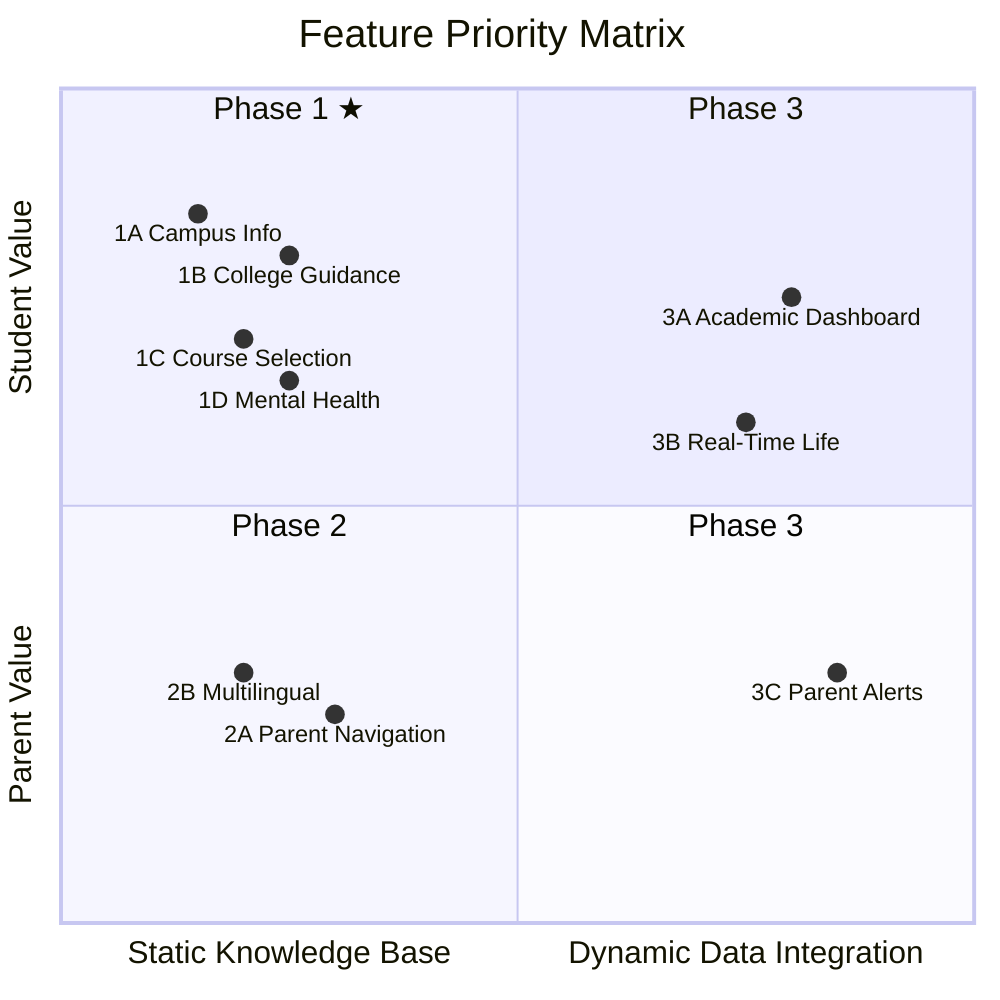
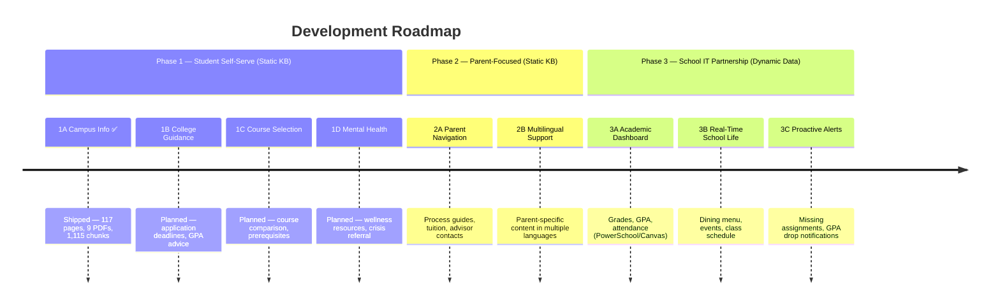

# WebbGPT Product Roadmap

> Feature priorities for a student-built RAG AI campus assistant.

---

## Prioritization Logic

Traditional product prioritization (e.g., "build for decision-makers first" or "ship a demo for business validation") does not apply here. This is a student project driven by interest and real usage.

**Core framework: Student Motivation x Technical Feasibility**

---

## Phase 1: Students Want It Most + Low Technical Barrier

All based on static knowledge base. Students can build end-to-end without external dependencies.

### 1A. Campus Info Assistant ✅ Shipped

**Status: Live** at [webb-ai.onrender.com](https://webb-ai.onrender.com)

Coverage categories:

| Category | Examples | Data Source |
|----------|----------|-------------|
| Courses & Credits | Course descriptions, prerequisites, graduation requirements | Course Catalog, curriculum pages |
| Boarding Life | Dorm policies, room changes, dorm facilities | Student Handbook |
| Passes & Leave | Overnight pass, weekend leave, sign-out procedures | Student Handbook |
| Transportation | Driving policy, pickup/dropoff, airport transport | Student Handbook |
| Campus Facilities | Library, gym, building locations, hours | webb.org |
| Clubs & Extracurriculars | Club list, how to join, activity schedules | webb.org |
| Athletics | Team info, schedules, tryouts, summer training | webb.org (33 team pages) |
| Summer Programs | Program tracks, dates, registration | webb.org |
| Discipline & Conduct | Honor Code, disciplinary policies, dress code | Student Handbook |
| Technology & Devices | WiFi, device requirements, AUP, tech support | AUP, Device Guidelines, Tech FAQ |
| Calendar & Schedule | Bell schedule, holidays, move-in/out dates | Travel Dates PDF, webb.org |
| Contacts & Directory | Teacher emails, department phones, advisor | webb.org, College Guidance Brochure |
| Admissions | Application process, campus tours, international students | webb.org |
| Campus Safety | Emergency contacts, safety procedures | Student Handbook |

What's been built:
- RAG pipeline: scrape → chunk → embed → retrieve → generate
- 117 pages from webb.org + 9 PDF documents → 1,115 chunks in ChromaDB (768-dim Gemini embeddings)
- Full multilingual support (any language in, any language out; cross-language retrieval)
- Streaming responses with source citations
- Mobile-responsive UI with favicon
- Deployed on Render (free tier, auto-deploy from main branch)

Known improvements pending:
- Meta-reference language in responses ("Based on the documents...") — awaiting school feedback
- LLM-based test judge has high false-positive rate — needs improvement

### 1B. College Guidance & Application Support

| Category | Examples | Data Source |
|----------|----------|-------------|
| College Guidance | Application timelines, recommendation letters, essay tips | College Guidance Brochure (ingested) |
| Application Deadlines | UC/Common App/CSU due dates, required materials | Need: deadline reference docs |
| College Matching | GPA-based college suggestions, acceptance history | Need: webb.org/acceptances, Naviance/Scoir |
| Transcripts & Testing | Transcript requests, standardized testing info | Need: counselor materials |
| Financial Aid (college) | FAFSA, CSS Profile, scholarship deadlines | Need: financial aid reference docs |
| a-g Requirements | UC eligibility, course-by-course requirements | Course Catalog (ingested) |

### 1C. Course Selection Helper

| Category | Examples | Data Source |
|----------|----------|-------------|
| Course Comparison | AP vs Honors differences, workload expectations | Course Catalog (ingested), curriculum pages (ingested) |
| Course Change Process | How to switch/drop courses, add/drop deadlines | Need: counselor process docs |
| Prerequisites | Required prior courses for advanced classes | Course Catalog (ingested) |
| GPA Calculation | Weighted vs unweighted, AP/Honors weighting | College Guidance Brochure (ingested) |
| Academic Support | Tutoring resources, study center, office hours | Need: academic support info |

### 1D. Mental Health & Wellness

| Category | Examples | Data Source |
|----------|----------|-------------|
| Counseling Services | School counselors, confidentiality, how to access | Student Handbook (ingested), webb.org |
| Crisis Resources | Hotline numbers, emergency referral procedures | Need: crisis resource list |
| Peer Support | Peer counseling programs, support groups | Need: student life materials |
| Health Services | School nurse, medical policies, medication rules | Student Handbook (ingested) |

---

## Phase 2: Parent-Focused Features + Low Technical Barrier

Same static knowledge base technology. Extends P1 content with parent-specific perspectives.

### 2A. Parent Process Navigation

| Category | Examples | Data Source |
|----------|----------|-------------|
| Tuition & Payment | Due dates, payment methods, payment plans | Need: billing/tuition docs |
| Financial Aid (school) | Application deadlines, required documents, renewal | webb.org (ingested) |
| Parent-School Communication | Parent conferences, progress reports, emergency contacts | Need: parent handbook |
| Academic Support | Tutoring resources, advisor contact, intervention process | Need: parent orientation materials |
| Visitor Policy | Weekend visits, check-in procedures, campus access | Student Handbook (ingested) |

### 2B. Multilingual Parent Support

| Category | Examples | Data Source |
|----------|----------|-------------|
| Multilingual Q&A | Any question in any language (already works) | All existing sources |
| Parent-Specific Testing | Validate coverage in Chinese, Korean, Spanish | Testing & prompt tuning |
| Translated FAQ | Common parent questions pre-tested in target languages | Need: curated FAQ content |

---

## Phase 3: Highest Value, Requires School IT Partnership

Cannot be built by students alone. Requires school IT to authorize API access and FERPA compliance.

### 3A. Personal Academic Dashboard

| Category | Examples | Requirement |
|----------|----------|-------------|
| Grades & Scores | Test scores, assignment grades, quarter grades | PowerSchool / Canvas API |
| GPA Tracking | Current GPA, GPA trend, class rank | PowerSchool API |
| Attendance | Absence record, tardy count | PowerSchool API |
| Missing Work | Overdue assignments, upcoming due dates | Canvas API |
| **Auth** | Student identity verification | SSO integration |

### 3B. Real-Time School Life

| Category | Examples | Requirement |
|----------|----------|-------------|
| Dining | Today's menu, allergen info, meal times | Dining menu data feed |
| Events & Activities | Weekend events, assemblies, special schedules | Calendar API |
| Sports Schedules | Game times, practice schedules, bus departures | Athletics calendar API |
| Personal Schedule | Next class, room number, teacher | PowerSchool API |

### 3C. Proactive Alerts for Parents

| Category | Examples | Requirement |
|----------|----------|-------------|
| Academic Alerts | Missing assignments, GPA drop below threshold | PowerSchool/Canvas API + push system |
| Financial Reminders | Tuition due dates, payment confirmations | Billing system integration |
| Attendance Alerts | Unexcused absences, tardy patterns | PowerSchool API + push system |
| **Config** | Notification preferences, opt-in/out, thresholds | Parent portal + notification service |

**When to pursue**: After Phases 1-2 demonstrate value and the school sees the results, IT will have motivation to open APIs.

---

## Immutable Boundary

Regardless of priority order, one rule always holds:

| Scope | Decision Authority |
|-------|-------------------|
| Static knowledge base (public info) | Students decide autonomously |
| Student personal data (grades, attendance) | Requires formal school authorization |

This is not a budget issue — it's a **FERPA compliance** issue. Reading student grades and attendance records without school authorization is illegal, even with good intentions. Students cannot bypass this just because they built the system.

---

## Recommended Starting Point

Instead of top-down priority assignment, ask club members:

> "What's the one thing you most want AI to help with at school?"

The answer will likely be: college application info, club search, or "how is GPA calculated?" — and that organic starting point will produce something genuinely useful.
